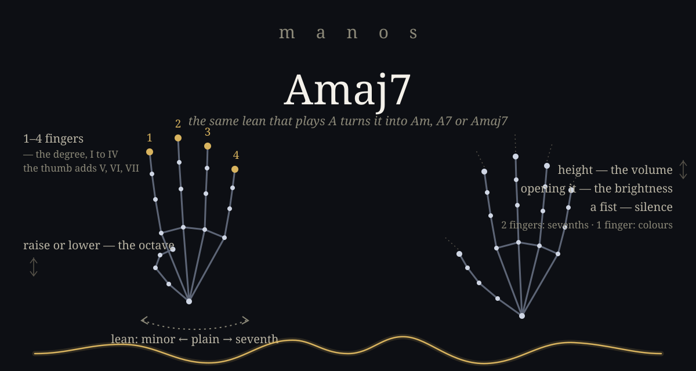

# manos

**An instrument you play in the air.** Your camera watches your hands, your
browser makes the sound, and a waveform draws whatever you are hearing. No
install, no account, no audio files — everything is synthesized live, and
nothing you do ever leaves your machine.

**Play it now → [manos-instrument.vercel.app](https://manos-instrument.vercel.app)**
— open it in Chrome or Edge and allow the camera.

Made for anyone from *never touched an instrument* to *professional who wants
to feel harmony in their body*.



## How it plays

It does not imitate a guitar or a piano — a D chord is a different shape on
every instrument anyway. Instead, your hands control the *music itself*:

| Gesture | What it does |
| --- | --- |
| **1–4 fingers** | The scale degree: I, II, III, IV |
| **Thumb out** | Adds five: V, VI, VII |
| **Lean the hand** | minor ← plain → seventh |
| **Raise / lower** | The octave |
| **Fist** | Silence |
| **Other hand** | Height is volume, opening it is brightness |
| **Other hand: 2 fingers** | Sevenths family — maj7, m9, 9 |
| **Other hand: 1 finger** | Colours — sus2, sus4, 6, m6 |
| **Slide to the edge** | ♭ on the left, ♯ on the right — chords outside the key |

The same lean that plays an A major turns it into Am, A7 or Amaj7. That is the
move a musician makes when they want a chord to ache — turned into something
you feel with your wrist.

## What's inside

- **Play any song.** Paste a chord chart — chords alone or over lyrics. It
  picks the key where the song needs the fewest tricks, shows the gesture for
  every chord, lights up green when you nail one, and follows you as you play.
- **13 scales** — from a guided five-note scale where nothing can clash,
  through harmonic minor, blues and the church modes, hirajoshi and hijaz, to
  the nine solfeggio frequencies (174–963 Hz) for sound-bath work. Tuning at
  440 or 432 Hz.
- **11 synthesized sounds** in four families — pads and voices, keys and
  plucks, bells and glass, bass and drones. In duet mode each hand can be a
  different instrument.
- **Conducted drums.** The beat keeps time on its own clock; your hand conducts
  it — fingers for density, height for volume, a fist mutes it right on the bar.
- **Record your take** — sound as 24-bit WAV ready for any DAW, or a shareable
  video of the whole performance (camera, hands, wave and sound, MP4), each
  with or without your own voice from the microphone. Headphones keep the
  voice clean. Nothing is uploaded; files save straight to disk.
- **MIDI out** (Chrome/Edge) — the gestures play *your* synths: GarageBand,
  Ableton, hardware. Volume rides CC7, brightness CC74. On a Mac, enable the
  IAC Driver in Audio MIDI Setup and pick it as the output.
- **Melody mode**, a live chord map, reverb / delay / chorus / drive, and an
  adjustable response feel. English and Spanish.

## Try it

The quick way: **[manos-instrument.vercel.app](https://manos-instrument.vercel.app)**.
The first visit downloads the hand-tracking model (~8 MB, cached afterwards).
Chrome or Edge recommended.

To run it locally instead:

```bash
npm install
npm run dev
```

Open http://localhost:3004 and allow camera access — the camera needs HTTPS or
localhost. `npm run build` produces a static `dist/` that deploys to any
static host.

## Privacy

The hand-tracking model (MediaPipe) runs entirely inside your browser, on your
GPU. There is no server, no analytics, and no image or audio ever leaves your
machine. Recording is assembled locally and saved straight to your disk.

## Feedback

The 🐛 button in the app opens a GitHub issue with the technical details
already filled in — or just [open one here](https://github.com/malenitaa/manos/issues).

## Enjoyed it?

If this was useful and you'd like to support the project:

- [Cafecito](https://cafecito.app/rezamalena)
- [Ko-fi](https://ko-fi.com/malenitaa)

## License

[MIT](LICENSE)
